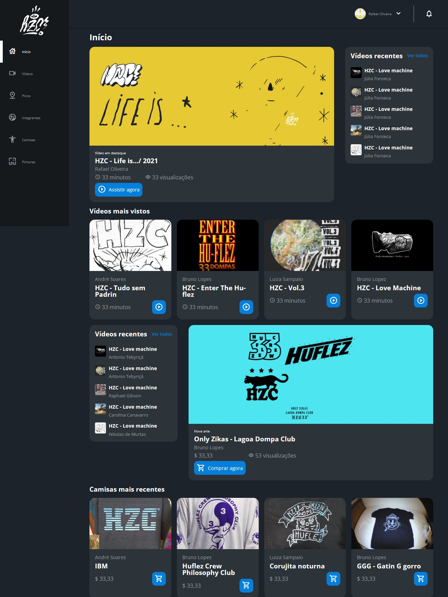

<h1 align="center">HZC</h1>

<h3 align="center">O Projeto HZC foi desenvolvido no cursos de Flex e Grid da Alura.</h3>

 

  

## Tópicos
- [Imagem](#img)
- [Descrição](#desc)
- [Acesso](#acesso)
- [Tecnologias](#tech)
- [Status](#status)
- [Licença](#license)

 

<h2 id="img">🖥️ Imagem do projeto</h2>

    

 

<h2 id="desc">💌 Descrição do projeto</h2>

    O HZC é um site voltado para quem gosta de andar de skate, para os skatistas 🛹. No HZC é possível encontrar muitas coisas interessantes para os fãs do esporte, como camisetas, pinturas, entre outras coisas legais.

 

<h2 id="acesso">💻 Acesso ao projeto</h2>

Clique [aqui](https://fel1324.github.io/HZC/) para acessar o projeto.

 

<h2 id="tech">🐱‍💻 Tecnologias utilizadas</h2>

* HTML e CSS
* Javascript
* Git e Github

 

<h2 id="status">🎴 Status do projeto</h2>

✔️ Projeto Finalizado

 

<h2 id="license">📇 Licença</h2>

Esse projeto está sob a licença MIT.
